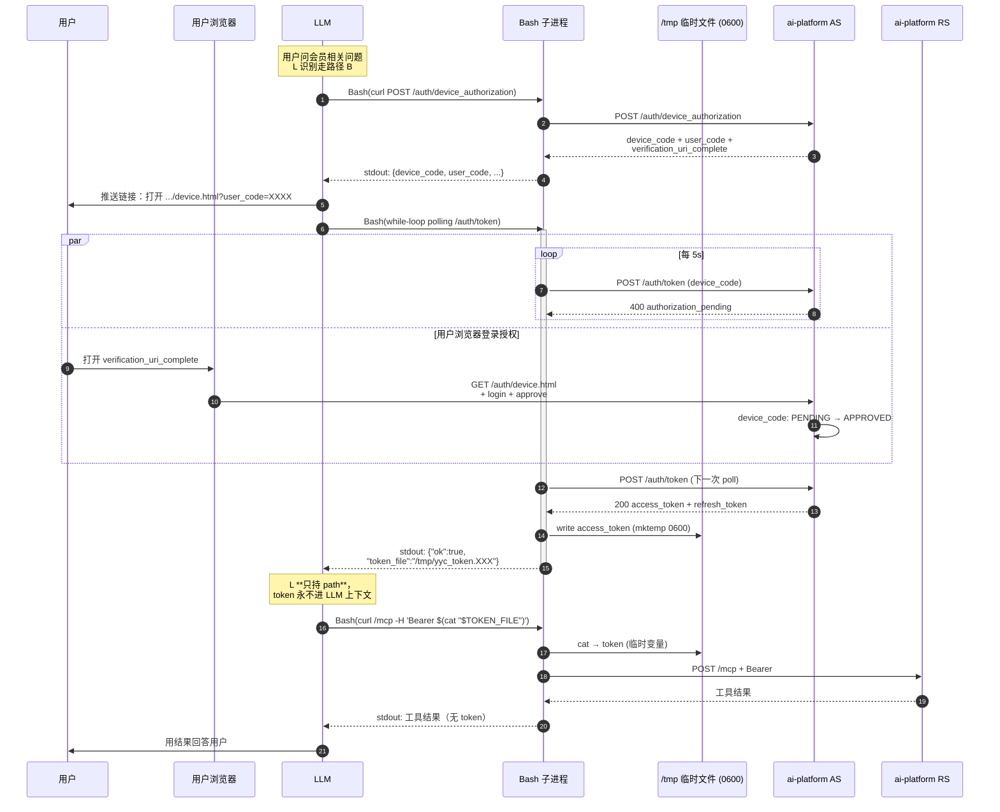

# 爷爷不泡茶 · 会员授权登录

## 触发条件

主 skill 的会员只读工具调用返回：

```json
{"isError": true, "content": [{"type":"text", "text":"oauth_required: 需要登录后才能调用会员工具，..."}]}
```

→ **不要假装查到**，按下面流程引导用户去登录页。

## 接入模式分流（先识别走哪条路）

后端 ai-platform 同时支持两条 OAuth 路径，sub-skill 这里二选一：

**自我反思一下能不能调 `mcp__*` 形态的工具**：

- ✅ **能调** → 路径 A：标准 PKCE（host 已注册 MCP，自动接 OAuth flow）
- ❌ **不能调，只能 Bash + curl 直打 `mcp_server.url`** → 路径 B：设备码 Device Authorization Grant

也可以按 host / 客户端类型查：

| host / 客户端 | 走哪条 |
|---|---|
| Claude Code / Claude Desktop / Cursor / Goose / Continue（已 `claude mcp add`）| 路径 A |
| Claude Code 等本地客户端但**未** `claude mcp add` | 路径 B（curl pattern） |
| openclaw / hermes / 飞书钉钉/企微 bot / IoT / 智能音箱 | 路径 B |
| 不支持 MCP 的通用 LLM 框架 + 自定义 skill | 路径 B（curl pattern） |

如果按上面对照表识别不出来，**主动用 ToolSearch 验证**，不要默认 A：

```
ToolSearch query="select:mcp__noyeyenotea-mcp__search_stores"
# 或关键词搜
ToolSearch query="yeyecha mcp"
```

- 返回 "No matching deferred tools" / 0 命中 → host 没注册 MCP → **走路径 B**
- 返回 `mcp__*` 工具定义 → host 已注册 → 走路径 A

**绝对不要默认走 A**——curl pattern 下走 A 必然失败（LLM 起不了 loopback 端口接 redirect），白让用户跑一次浏览器登录还回不来。"先试 A 不行再退 B" 也是反模式。

---

## 路径 A：标准 PKCE（host 已注册 MCP）

### A.1 授权页 URL 推导（关键，绝不写死域名）

**绝对不能写死 `https://mcp.yeyecha.com/auth/login.html`**——会让 dev / 灰度环境的用户被引到生产授权页。每次都要从当前 mcp_server.url 动态推导：

1. 取 `skill.json.mcp_server.url`（运行时由 MCP 协议或 skill 元数据可得）
2. 取 origin（剥末尾 `/mcp` 路径）
3. 拼上 `/auth/login.html`

例（committed skill 默认 mcp_server.url 指向 prod）：

| mcp_server.url 当前指向 | 推导出的授权页 |
|---|---|
| `https://mcp.yeyecha.com/mcp`（committed 默认）| `https://mcp.yeyecha.com/auth/login.html` |

> dev / 灰度环境的 origin 由 `bash dev/skill-env.sh` 切换并自动派生，本表不枚举；推导规则与上面 3 步一致。

### A.2 引导话术（直接念）

> 查这个需要先登录授权。请打开 \<推导出的 URL\>，用手机号 + 收到的短信验证码完成登录，登录成功后再问我就能查到了。

如果用户问"为什么要登录"：

> 我不能替你查别人账号的会员信息或券，得你本人授权一下。授权只要一次，同一个会话之后都不用再登。

### A.3 流程（用户视角）

1. 用户在浏览器打开授权页
2. 输手机号 → 拿真实短信验证码（**不是固定值**）
3. 输验证码 → 提交
4. 浏览器自动重定向回 host 的 loopback 端口，host 拿到 access_token 后续自动带 `Authorization: Bearer ...` 头
5. 用户回来再问，AI 重新调一次工具就拿到真实数据

---

## 路径 B：设备码 Device Authorization Grant（cloud agent / curl pattern）

适用：host 没注册 MCP（curl pattern），或 cloud agent 跟用户浏览器不在一台机器上（openclaw / hermes / IM bot / IoT）。

后端遵循 **RFC 8628 OAuth 2.0 Device Authorization Grant** 标准。ai-platform 已完整实现，端点 `/auth/device_authorization` + `/auth/device.html` + `/auth/device/approve` + `/auth/token` 都现成可用。

### B.1 LLM 行为概览

```
1. LLM 调一次 curl POST /auth/device_authorization
   → 拿到 device_code (256 位高熵) + user_code (8 位易读) + verification_uri_complete

2. LLM 把 verification_uri_complete 推给用户
   "请打开链接登录：<URL>。10 分钟内有效。"

3. LLM 启动 Bash polling 循环（关键：循环在 Bash 里，不在 LLM turn 里）
   while; do curl POST /auth/token; case error in ...; sleep; done

4. 循环退出后，Bash **把 token 写到 /tmp/yyc_token.XXXXXX**（mktemp 自动 0600 权限），stdout 只回 path（**不回 token 本身**）
   LLM 后续每次 curl POST /mcp 时用 -H "Authorization: Bearer $(cat $TOKEN_FILE)" 内联读取
   **token 从不进 LLM 对话上下文** —— "不回显 token" 从约定变物理保证
```

### B.2 关键约束：polling 由 Bash 子进程做，不是 LLM

**绝对不要让 LLM 在 turn 之间反复轮询**——每次 turn 生成一条 curl 拿 `authorization_pending` → sleep → 再生成。10 分钟 polling = ~120 个 turn，烧 context 也烧 token，用户体感"AI 一直在打字"。

✅ **正确做法**：LLM 生成**一条** Bash 命令，把 polling 循环写在 Bash 里，**单个 turn 等 Bash 退出**（也可 `background=true`，更省）。Bash 退出时要么 stdout 含 token_file path，要么是 timeout / 错误。完整流程通常只占 LLM ~3 个 turn（发 device_authorization / 等 polling / 调 MCP）。

### B.2.1 ⚠️ 致命陷阱：device_code 必须一致（一体化 vs 分两步）

§B.3 的 Bash 模板把 `device_authorization` 和 polling 写在**同一个脚本里**——这是最安全的方式，device_code 在内存变量里直接传给 while 循环，绝不会错。

**如果拆成两步（先 foreground 拿 URL 展示给用户，再 background 启动 polling），必须复用同一个 device_code：**

❌ **错误做法**：两步各自独立调 `/auth/device_authorization` → 拿到**不同的 device_code**，用户授权的是 A，polling 等的是 B → 永远不会成功，用户被迫授权两次。（真实事故：LLM 先 foreground 调 device_authorization 拿到 2G3M-S6RL 给用户，然后 background 启动的 polling 脚本又调了一次 device_authorization 拿到新 code，用户登完 A 但 polling 在等 B，永远超时。）

✅ **正确做法（必须拆两步时）**：
1. 第一步（foreground）调 `device_authorization`，记录 `$DC`（device_code）
2. LLM 展示 URL 给用户
3. 第二步（background）把 **同一个** `$DC` 硬编码进 polling 脚本，**不要再调 device_authorization**

```bash
# 第二步 polling：DC 用第一步拿到的值，不要再调 device_authorization！
AS=https://mcp.yeyecha.com
DC="<第一步拿到的 device_code>"
DEADLINE=$(($(date +%s) + 600))
# ... (while 循环同 §B.3)
```

**强烈建议**：除非有特殊原因，否则**直接用 §B.3 的一体化脚本**（device_authorization + polling 同一条 Bash 命令），不要拆分。

### B.3 Bash 模板（直接 copy，把 $AS 换成推导出的 origin）

```bash
AS=https://mcp.yeyecha.com           # 从 mcp_server.url 剥末尾 /mcp 推导

# Step 1: 拿 device_code + user_code
RESP=$(curl -sS -X POST "$AS/auth/device_authorization" \
  -H 'Content-Type: application/x-www-form-urlencoded' \
  -d 'client_id=mcp-public&scope=read.member+read.coupon+read.order')
DC=$(echo "$RESP" | jq -r .device_code)
UC=$(echo "$RESP" | jq -r .user_code)
URL=$(echo "$RESP" | jq -r .verification_uri_complete)
echo "推给用户: $URL  (user_code: $UC)"

# Step 2: 把 $URL 推给用户后，启动 polling
DEADLINE=$(($(date +%s) + 600))      # 10 min TTL（与 expires_in 对齐）
INTERVAL=5                           # spec 推荐起步值
while [ $(date +%s) -lt $DEADLINE ]; do
  TR=$(curl -sS -X POST "$AS/auth/token" \
    -H 'Content-Type: application/x-www-form-urlencoded' \
    -d "grant_type=urn:ietf:params:oauth:grant-type:device_code" \
    -d "device_code=$DC" -d "client_id=mcp-public")
  ERR=$(echo "$TR" | jq -r '.error // empty')
  case "$ERR" in
    authorization_pending) sleep $INTERVAL ;;
    slow_down)             INTERVAL=$((INTERVAL+5)); sleep $INTERVAL ;;
    "")
      # 拿到 token——把 token 隔离到临时文件，stdout 只回 path（不回 token）
      ACCESS_TOKEN=$(echo "$TR" | jq -r .access_token)
      TOKEN_FILE=$(mktemp -t yyc_token.XXXXXX)        # mktemp 自动 0600
      printf '%s' "$ACCESS_TOKEN" > "$TOKEN_FILE"
      unset ACCESS_TOKEN TR                            # 别留 shell 变量副本
      echo '{"ok":true,"token_file":"'"$TOKEN_FILE"'"}'
      exit 0 ;;
    expired_token|access_denied|invalid_grant)
                           echo "$TR" >&2; exit 1 ;;   # 终止条件
    *)                     echo "$TR" >&2; exit 1 ;;
  esac
done
echo '{"error":"client_timeout"}' >&2; exit 1
```

stdout 成功时只回 `{"ok":true,"token_file":"/tmp/yyc_token.XXXXXX"}` —— token 字符串本身**永远不进 LLM 对话上下文**。LLM 只把 path 记下来，后续 MCP 调用 inline 读文件：

```bash
TOKEN_FILE=/tmp/yyc_token.XXXXXX   # 从上一步 stdout 拿到的 path
curl -sS -X POST "$AS/mcp" \
  -H "Authorization: Bearer $(cat "$TOKEN_FILE")" \
  -H 'Content-Type: application/json' \
  -H 'Accept: application/json, text/event-stream' \
  -d '{"jsonrpc":"2.0","id":1,"method":"tools/call",
       "params":{"name":"get_my_coupons","arguments":{}}}'
```

⚠️ **必须用 inline `$(cat "$TOKEN_FILE")`**，不要先 `TOKEN=$(cat ...)` 再 `Bearer $TOKEN` —— 后者会让 token 在 shell 变量里多留一份（debug print / set -x / shell history 都可能漏）。inline 形式 token 只活在 curl 的请求头一次。

### B.4 引导话术

拿到 user_code 和 URL 后，对用户说：

> 查这个需要先登录授权。请打开这个链接：\<verification_uri_complete\>
> 用手机号 + 收到的短信验证码登录就行。我等你登完。

如果用户问"要不要输什么验证码"：

> 不用输什么。链接打开就是登录页，按手机号 + 短信验证码登录即可。10 分钟内有效。

### B.5 device flow 错误码 → 用户话术

| 后端错误 | 对用户的话 |
|---|---|
| authorization_pending（pollin 中正常状态）| **不展示给用户**——LLM 内部处理，继续 sleep poll |
| slow_down | **不展示给用户**——LLM 内部把 interval 加 5s |
| expired_token | "登录链接过期了（10 分钟没操作），要重新发一个吗？" |
| access_denied | "看起来这次没点确认，可以再发一次链接重试" |
| invalid_grant | "登录这一步有点问题，咱重新来一次" |
| client_timeout（Bash 主动 timeout）| "等了 10 分钟没等到登录，要不重新发链接？" |

### B.6 序列图



---

## 红线（两条路径都适用）

- ❌ **代登录**：用户给手机号、验证码、密码请直接拒绝。授权必须由用户在浏览器完成。
- ❌ **回显 access_token / Authorization 头 / device_code / refresh_token**：哪怕片段也不能出现在用户可见的回复里。路径 B 下，token 由 mktemp 文件 (0600) 隔离 + LLM 只持 path 的设计**物理上保证 LLM 看不到 token JSON**——这条红线从此是设计兜底而非约定。
- ❌ **路径 B 用 `cat` 直接把 token 文件内容回显到用户对话或 Bash stdout**（例如 `cat /tmp/yyc_token.XXX` 单独跑）：哪怕调试也不行。验证 token 工作只用 `curl -H "Bearer $(cat $FILE)"` 这种 inline 读取——token 只活在 curl 一次，不进 LLM context。
- ❌ **提及任何固定/默认验证码**："654321"/"开发版固定 XXX"/"验证码默认是 XXX" 等话术绝对禁止。所有环境都走真实阿里云短信，每次随机生成。引导只说"用手机号 + 收到的短信验证码登录"。
- ❌ **假装已经查到**："我看你是 VIP 会员"——未授权时坦诚说明。
- ❌ **LLM turn-level polling**（路径 B 专属）：每次 turn 一个 curl 等"authorization_pending"是反模式，必须把循环放 Bash 里。

## 通用错误码 → 用户话术（登录子流程，两条路径共用）

授权流程中可能遇到的常见错误，对外话术不暴露技术细节：

| 后端码/标识 | 对用户的话 |
|---|---|
| 短信发送失败 / sms_failed | "短信发不出去，可能运营商有点延迟，稍等一下再点'重发'" |
| 验证码错误 / invalid_otp | "验证码不对哦，再核对一下，或者点'重发'拿张新的" |
| 验证码过期 / otp_expired | "这条验证码过期了，重新获取一张" |
| 登录态过期 / token_expired | "登录过期了，麻烦再走一次刚才那个登录链接" |
| 用户取消授权 | "看起来你这次没点确认，可以再打开链接试试" |
| 网络异常 | "网络有点问题，稍后再试，或者直接打开爷爷不泡茶小程序看也行" |

device flow 路径专属错误码（poll 阶段）见 §B.5。

## 缓存与会话

按路径分两种 token 存储语义：

**路径 A（标准 PKCE）**：
- access_token 由 host (Claude Code / Desktop / 其他客户端) 自动缓存到当前会话
- 同一会话内不用重复登录；新会话自然失效，重走路径 A 即可
- token 存在 host 的 secure storage（keyring / 加密文件），实现细节由 host 决定

**路径 B（device flow + curl pattern）**：
- access_token 由 Bash 写到 `/tmp/yyc_token.XXXXXX`（mktemp 自动 0600 权限），LLM **只在对话上下文记 token_file path**
- **token 字符串本身永远不进 LLM 上下文** —— 后续 MCP 调用用 `$(cat "$TOKEN_FILE")` 内联读取
- 每次 MCP 调用前回顾"当前会话有没有 token_file path"——没有就触发路径 B 重新拿；有就 inline cat
- 跨会话失效：新对话要重走 device flow 拿新文件；旧文件可由用户偶尔 `rm /tmp/yyc_token.*` 清理（不清也无大碍：mktemp 路径每次随机、token 1 小时过期）
- token 寿命默认 1 小时（access_token expires_in: 3600）；接近过期可用 refresh_token 走 `/auth/token` grant_type=refresh_token 续，refresh_token 也应当走同样的"写文件不进上下文"模式

token 存哪儿、怎么过期，**永远不要在用户对话中提及**——这是 LLM 内部状态。同理，token_file path 不需要给用户看（path 不是 secret，但用户不关心）。

## 维护者参考（不展示给用户）

### 协议

- 路径 A：OAuth 2.1 + PKCE（S256），grant_type=`authorization_code`
- 路径 B：OAuth 2.0 Device Authorization Grant（RFC 8628），grant_type=`urn:ietf:params:oauth:grant-type:device_code`
- 资源服务器：`POST /mcp`（受 JwtAuthFilter 守卫，Bearer JWT 验签）

**两条路径的 OAuth 客户端"主体"不同**（决定了 `skill.json.auth.*` 字段的实际作用范围）：

- **路径 A** 的 OAuth 客户端是 _host_（Claude Code / Cursor 等内置 OAuth client + loopback 监听端口）。host 自动读取 `skill.json.auth.*` 当 OAuth metadata 来发现端点 → 完成 PKCE flow → 后续 `mcp__*` 工具调用对 LLM 透明带 Bearer。
- **路径 B** 的 OAuth 客户端是 LLM 控制的 _Bash 子进程_（curl + 写 mktemp 文件）。LLM 在路径 B 里**根本不读** `skill.json.auth.*` —— 端点全部按本 sub-skill §B.3 的 Bash 模板硬编码。

所以 `skill.json.auth.type: oauth2_pkce` 这个字段对路径 B 没有约束力 —— 字段是给 host-aware 客户端识别的"暗号"，不是 PKCE-only 的承诺。两条路径独立工作，互不干扰。

### 端点速查（由 mcp_server.url 同 origin 派生）

| 端点 | 路径 A | 路径 B |
|---|:---:|:---:|
| `/.well-known/oauth-authorization-server` 元数据 | ✓ | ✓ |
| `/auth/authorize` 授权端点 | ✓ |   |
| `/auth/token` 令牌端点 | ✓ | ✓（device_code 分支）|
| `/auth/login.html` 用户手机号+验证码登录页 | ✓ | ✓（被 device.html 跳转）|
| `/auth/device_authorization` device flow 申请 |   | ✓ |
| `/auth/device.html` 用户输 user_code 页面 |   | ✓ |
| `/auth/device/approve` 用户同意授权 |   | ✓（私有协议）|

### 默认 client_id 与 scope

- client_id: `mcp-public`（公共客户端，所有 MCP 接入方共用，无 secret，靠 PKCE 或 device_code 防截获）
- scopes: `read.member` / `read.coupon` / `read.order`（按工具拆，最小化）

### 状态存储

- 后端 OAuth 状态走 Redis（`aip:auth:*`），多实例水平扩
- skill.json 顶层 `auth.*` 字段是这套元数据的快照，**改环境用 `dev/skill-env.sh`，不要手编**

### 路径 B token 流转（图示）

```
                                    ┌─────────────────────────┐
Bash polling (Sh) ──[拿到 token]──► │ /tmp/yyc_token.XXXXXX   │ (mktemp, 0600)
                                    │  里只有 access_token     │
                                    └────────────┬────────────┘
                                                 │
                                                 │ $(cat "$TOKEN_FILE")
                                                 ▼
                          后续 MCP curl ──── inline 读取 ──── /mcp + Bearer

LLM context: 只持 token_file path（path 不是 secret）
              ↑
              └── 物理保证：token JSON 永不进 conversation context
```

设计理由：path 不能换 token（光有 path 没文件读权限也没用），单独泄漏无危害；token 本身从不进 LLM 上下文意味着 prompt cache / API payload / transcript / 调试日志都看不到 token。

### 详细设计

- 入口 + 选型: ai-platform `docs/mcp-auth-design-overview.md`
- 路径 A 实现细节: ai-platform `docs/mcp-oauth-pkce.md`
- 路径 B 实现细节: ai-platform `docs/mcp-oauth-device-flow.md`（含 11 步真实样例 + Java 类索引 + cheatsheet）
